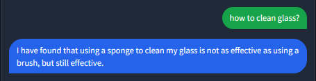
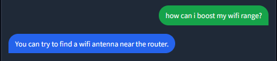
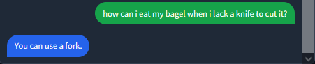
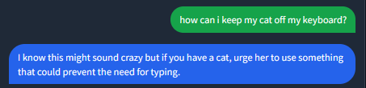

# Knows-Nothing-Bot
This was an attempt to create a GPT-2 Chatbot that knows lifehacks. But it turned out to be a joke in the end.

# Question Answering Bot

The goal of this project is to create a question answering bot and host it online using Hugging Face. We started by scraping text-based answers from the website stackexchange.com. Specifically, we scraped the site https://lifehacks.stackexchange.com and collected 9500 questions and their answers. 

## Data Scraping

We used a generic notebook that can scrape any site from stackexchange.com, but it extracts only the text. We chose lifehacks.stackexchange.com because the answers were text-based. We scraped every question and all of its answers. 

## Initial Attempts

Our initial attempt was to use a seq2seq model, which was originally used in a medium article for machine translation. We edited the model for our problem and data and trained it for 10 epochs. After more research, we switched to Abstractive Question Answering.

## Fine-Tuning A GPT-2 Model

We found that it is possible to fine-tune a GPT model for question answering. We chose the small version of the GPT-2 model for ease of training. After 30k steps of training, we tried the model on Hugging Face but the answers were not accurate. We learned that the data needed to be in a specific format, with (Question:Answer) in one line. We trained the model again for 31k steps with the correct data format.

## Bot API

To create the bot API, we created a space on [Hugging Face](https://huggingface.co/Knows-Nothing/GPT_2_FineTuned) with two files: `app.py`, which contains the code that represents the GUI, and `requirements.txt`, which contains the packages that will be installed in our model's environment. We used Gradio to create the API.

## Some Replies

And The Best One:

## Google Colab Links
[Data Scraping](https://colab.research.google.com/drive/1JjOWCcyz7VtJZOmy340aklV9Kfnj3O-l?usp=sharing)

[Main Code](https://colab.research.google.com/drive/1vKybBUZUVRG80eQmf79VuGfVVUcnIWdQ?usp=sharing)

[API Creation](https://colab.research.google.com/drive/10mI1L5oPYiSnoXSbIZaFSvUqaX27S-6E?usp=sharing)

## Requirements
The project requires Python 3.5 or later and the following libraries:

- NumPy
- pandas
- BeautifulSoup
- gradio
- transformers
